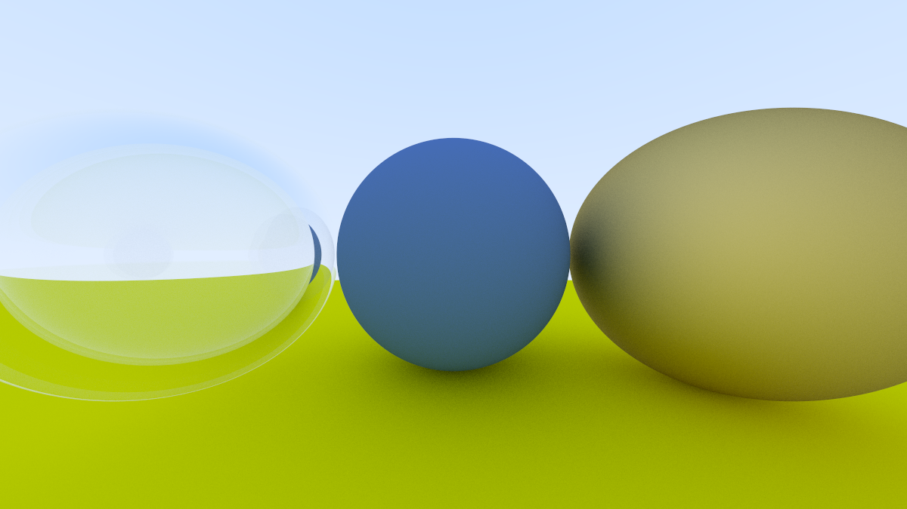
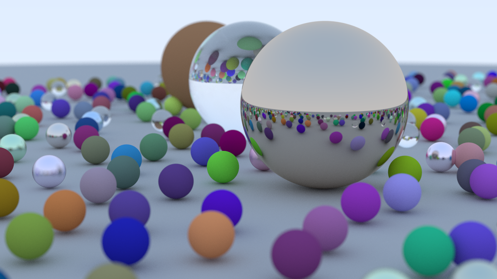
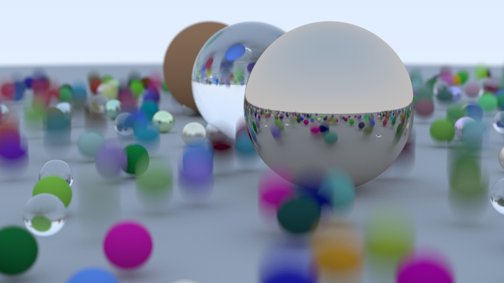
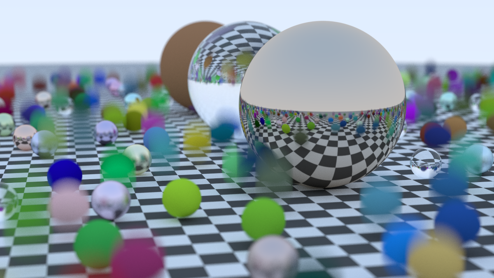
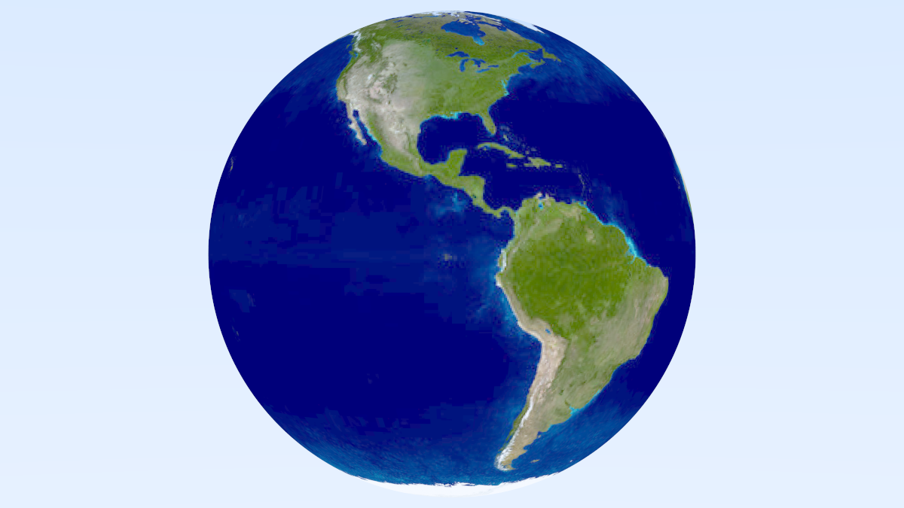
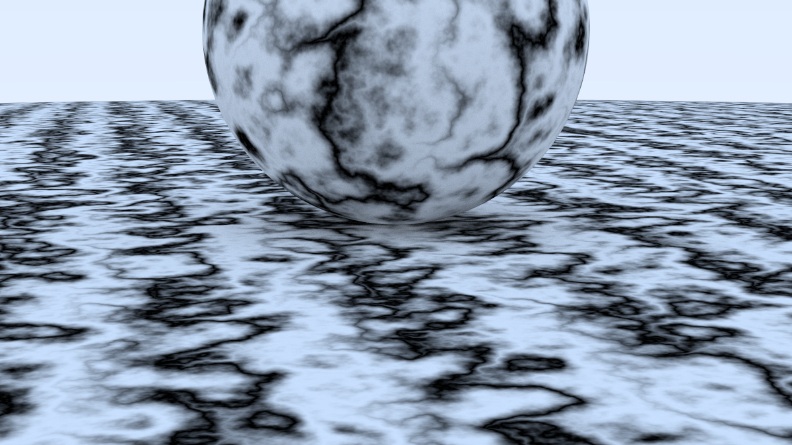

Ray Tracing with Rust
====================================================================================================

| ![RT in One Weekend][cover1] | ![RT The Next Week][cover2] |
|:----------------------------:|:---------------------------:|
|   [In One Weekend][book1]    |   [The Next Week][book2]    |

Run code:
```
cargo r --release --example rt-the-next-week_6_6
```

---

*Ray Tracing in One Weekend. Chapter 11.5*

---

*Ray Tracing in One Weekend. Chapter 12.2.2*

---

*Ray Tracing in One Weekend. Chapter 13.2*

---

*Ray Tracing in One Weekend. Chapter 14.1*

---

*Ray Tracing: The Next Week. Chapter 3.10*

---

*Ray Tracing: The Next Week. Chapter 4.2*

---

*Ray Tracing: The Next Week. Chapter 4.6*

---

*Ray Tracing: The Next Week. Chapter 5.7*

---

*Ray Tracing: The Next Week. Chapter 6.6*

[book1]:  https://raytracing.github.io/books/RayTracingInOneWeekend.html
[book2]:  https://raytracing.github.io/books/RayTracingTheNextWeek.html
[book3]:  https://raytracing.github.io/books/RayTracingTheRestOfYourLife.html
[cover1]: docs/covers/CoverRTW1-small.jpg
[cover2]: docs/covers/CoverRTW2-small.jpg
[cover3]: docs/covers/CoverRTW3-small.jpg
